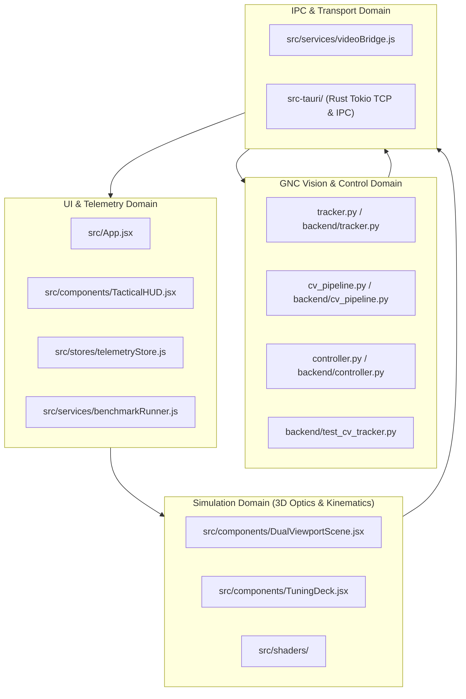

<!-- eng-org:graphyfy generated 2026-09-28T22:33:00+05:30 -->
# Domain Ownership & Subsystem Relationships

*Domain boundaries mapping code ownership and responsibilities.*

```mermaid
flowchart TB
  subgraph Domain_Sim["Simulation Domain (3D Optics & Kinematics)"]
    D_DualView["src/components/DualViewportScene.jsx"]
    D_Tuning["src/components/TuningDeck.jsx"]
    D_Shaders["src/shaders/"]
  end

  subgraph Domain_Vision["GNC Vision & Control Domain"]
    D_Tracker["tracker.py / backend/tracker.py"]
    D_Pipeline["cv_pipeline.py / backend/cv_pipeline.py"]
    D_Controller["controller.py / backend/controller.py"]
    D_Tests["backend/test_cv_tracker.py"]
  end

  subgraph Domain_UI["UI & Telemetry Domain"]
    D_App["src/App.jsx"]
    D_HUD["src/components/TacticalHUD.jsx"]
    D_Store["src/stores/telemetryStore.js"]
    D_Bench["src/services/benchmarkRunner.js"]
  end

  subgraph Domain_Bridge["IPC & Transport Domain"]
    D_Bridge["src/services/videoBridge.js"]
    D_Tauri["src-tauri/ (Rust Tokio TCP & IPC)"]
  end

  Domain_UI --> Domain_Sim
  Domain_Sim --> Domain_Bridge
  Domain_Bridge --> Domain_Vision
  Domain_Vision --> Domain_Bridge
  Domain_Bridge --> Domain_UI
```
