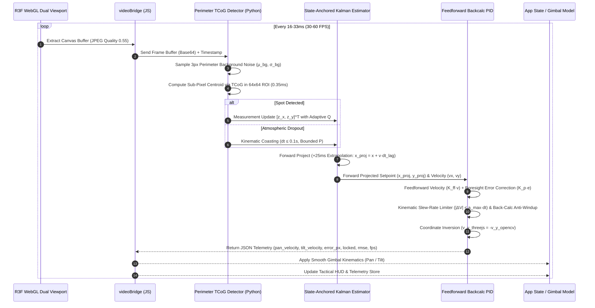

<!-- eng-org:graphyfy generated 2026-09-28T22:33:00+05:30 -->
# Real-Time 30-60 FPS GNC Vision & Control Pipeline

*The millisecond-by-millisecond frame processing and feedback pipeline.*

```mermaid
sequenceDiagram
  autonumber
  participant Canvas as R3F WebGL Dual Viewport
  participant Bridge as videoBridge (JS)
  participant TCoG as Perimeter TCoG Detector (Python)
  participant KF as State-Anchored Kalman Estimator
  participant GNC as Feedforward Backcalc PID
  participant App as App State / Gimbal Model

  loop Every 16-33ms (30-60 FPS)
    Canvas->>Bridge: Extract Canvas Buffer (JPEG Quality 0.55)
    Bridge->>TCoG: Send Frame Buffer (Base64) + Timestamp
    TCoG->>TCoG: Sample 3px Perimeter Background Noise (μ_bg, σ_bg)
    TCoG->>TCoG: Compute Sub-Pixel Centroid via TCoG in 64x64 ROI (0.35ms)
    alt Spot Detected
      TCoG->>KF: Measurement Update [z_x, z_y]^T with Adaptive Q
    else Atmospheric Dropout
      TCoG->>KF: Kinematic Coasting (dt ≤ 0.1s, Bounded P)
    end
    KF->>KF: Forward Project (+25ms Extrapolation: x_proj = x + v·dt_lag)
    KF->>GNC: Forward Projected Setpoint (x_proj, y_proj) & Velocity (vx, vy)
    GNC->>GNC: Feedforward Velocity (K_ff·v) + Boresight Error Correction (K_p·e)
    GNC->>GNC: Kinematic Slew-Rate Limiter (|ΔV| ≤ a_max·dt) & Back-Calc Anti-Windup
    GNC->>GNC: Coordinate Inversion (v_y_threejs = -v_y_opencv)
    GNC-->>Bridge: Return JSON Telemetry (pan_velocity, tilt_velocity, error_px, locked, rmse, fps)
    Bridge-->>App: Apply Smooth Gimbal Kinematics (Pan / Tilt)
    Bridge-->>App: Update Tactical HUD & Telemetry Store
  end
```
