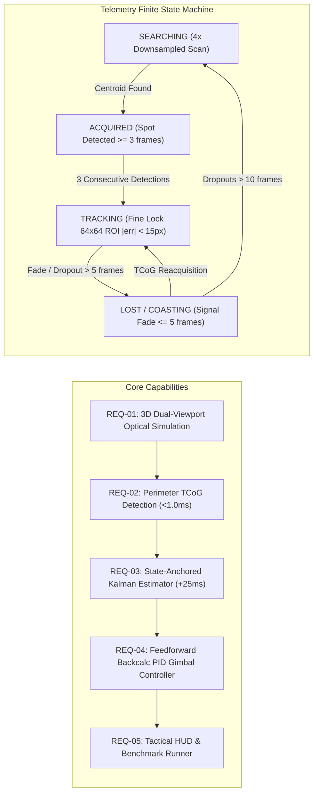

<!-- eng-org:graphyfy generated 2026-09-28T22:33:00+05:30 -->
# Requirements & State Transition DAG

*Requirements dependency graph and tracking state machine.*

```mermaid
flowchart LR
  subgraph Capabilities["Core Capabilities"]
    REQ_01["REQ-01: 3D Dual-Viewport Optical Simulation"]
    REQ_02["REQ-02: Perimeter TCoG Detection (<1.0ms)"]
    REQ_03["REQ-03: State-Anchored Kalman Estimator (+25ms)"]
    REQ_04["REQ-04: Feedforward Backcalc PID Gimbal Controller"]
    REQ_05["REQ-05: Tactical HUD & Benchmark Runner"]
  end

  REQ_01 --> REQ_02
  REQ_02 --> REQ_03
  REQ_03 --> REQ_04
  REQ_04 --> REQ_05

  subgraph StateMachine["Telemetry Finite State Machine"]
    ST_SEARCH["SEARCHING (4x Downsampled Scan)"]
    ST_ACQUIRE["ACQUIRED (Spot Detected >= 3 frames)"]
    ST_TRACK["TRACKING (Fine Lock 64x64 ROI |err| < 15px)"]
    ST_LOST["LOST / COASTING (Signal Fade <= 5 frames)"]

    ST_SEARCH -->|Centroid Found| ST_ACQUIRE
    ST_ACQUIRE -->|3 Consecutive Detections| ST_TRACK
    ST_TRACK -->|Fade / Dropout > 5 frames| ST_LOST
    ST_LOST -->|TCoG Reacquisition| ST_TRACK
    ST_LOST -->|Dropouts > 10 frames| ST_SEARCH
  end
```
